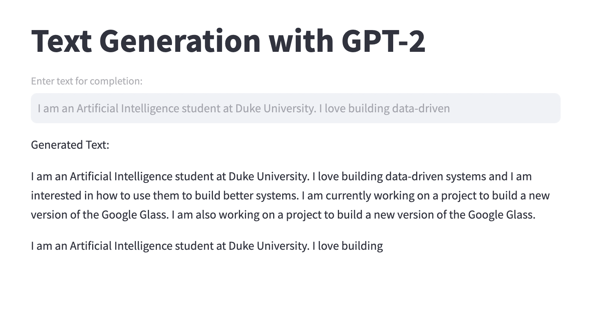

# Text Generation Web App using GPT-2

This is a simple web application built with Streamlit that demonstrates text generation using the GPT-2 model from Hugging Face.

## Functionality

The web application allows users to input text and generates additional text based on the input using the GPT-2 model. The generated text is then displayed back to the user.

## Connection to Open Source LLM

The GPT-2 model used in this web application is an open-source language model provided by Hugging Face through their Transformers library. The model has been fine-tuned on a large corpus of text and can generate coherent and contextually relevant text based on user input.

## Deployment

The web application is deployed using Streamlit Sharing, a platform provided by Streamlit for deploying Streamlit apps. You can access the deployed application via the following link:

## Usage

To use the web application:

1. Input text into the text input field provided.
2. Click on the "Generate" button.
3. The generated text will appear below the input field.

## Local Setup

To run the web application locally:

1. Install the necessary dependencies by running: pip install streamlit transformers
2. Clone this repository.
3. Navigate to the repository directory in your terminal.
4. Run the following command:
5. Open your web browser and go to `http://localhost:8501` to view and interact with the web application.

